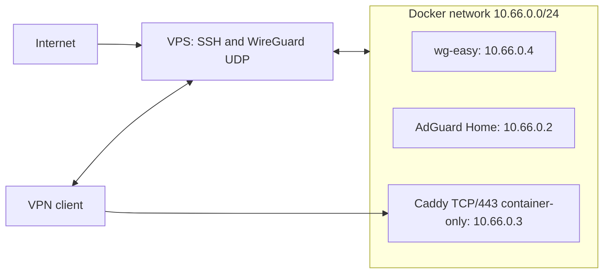

# Ansible Zero-Trust VPS


Deploy a self-hosted zero-trust VPS with WireGuard, wg-easy, AdGuard Home,
Caddy, UFW, and fail2ban using Ansible. Choose the public installer for one
fresh VPS or remote Ansible deployment when a controller manages the host.

## Quick Start

### Public Install

Use this mode from an interactive SSH session on a fresh single VPS. Run the
tagged installer on the VPS, not from your laptop:

```bash
curl -fsSL https://raw.githubusercontent.com/NikitaS2001/ansible-zero-trust-vps/v1.1.0/install.sh | sudo bash
```

It asks for the SSH port, WireGuard port, Admin username, Admin password,
AdGuard admin password, WireGuard panel password, Internal domains, WireGuard public hostname or IP, and SSH public key. For automation, set
`ZERO_TRUST_NONINTERACTIVE=1` and supply the documented `ZERO_TRUST_*` inputs.

Use release tags, not `main`, for real installs. To test unreleased changes on
a disposable VPS, override `ZERO_TRUST_REPO_URL` and `ZERO_TRUST_RELEASE_REF`:

```bash
TEST_REF=feature/test
curl -fsSL "https://raw.githubusercontent.com/NikitaS2001/ansible-zero-trust-vps/${TEST_REF}/install.sh" \
  | sudo env ZERO_TRUST_REPO_URL=https://github.com/NikitaS2001/ansible-zero-trust-vps.git \
      ZERO_TRUST_RELEASE_REF="${TEST_REF}" bash
```

The installer passes secrets in a temporary `0600` extra-vars file and removes
it after success or failure. Before it changes SSH, open the new provider
firewall port and keep the original SSH session open until a new login works.
The panel password and WireGuard host collected above automatically bootstrap
wg-easy on its first start.

### Remote Deployment

Use this mode from an Ansible controller (your laptop or management host) to
manage a VPS. From a checkout, copy all examples, then edit
`inventory/hosts.yml` and `group_vars/all/vars.yml`; set a real `$2y$...`
AdGuard hash in the service vault, plus `wg_public_host` and
`wg_easy_admin_password` for unattended wg-easy bootstrap.

```bash
cp inventory/hosts.yml.example inventory/hosts.yml
cp group_vars/all/vars.yml.example group_vars/all/vars.yml
cp group_vars/all/vault_services.yml.example group_vars/all/vault_services.yml
cp group_vars/all/vault_ssh.yml.example group_vars/all/vault_ssh.yml
ansible-vault encrypt group_vars/all/vault_services.yml group_vars/all/vault_ssh.yml
python3 -m pip install --user "ansible-core==2.19.11" "passlib[bcrypt]" "bcrypt<4.1"
ansible-galaxy collection install -r requirements.yml
ansible-playbook --ask-vault-pass --syntax-check site.yml
ansible-playbook --ask-vault-pass site.yml -u root
```

Before a subsequent rerun, update `inventory/hosts.yml` after the initial root
deployment:

```yaml
ansible_user: "<admin_user>"
ansible_port: <ssh_port>
```

## What Gets Deployed

The playbook hardens the host, creates a non-root admin, then orchestrates
Docker, wg-easy, AdGuard Home, and Caddy. Only SSH and WireGuard UDP are
public: Caddy serves VPN-only HTTPS from inside the Docker network, and host
TCP/443 is closed.



| Service | Image | Exposure |
| --- | --- | --- |
| wg-easy | `ghcr.io/wg-easy/wg-easy:15.3.0` | WireGuard UDP; panel on localhost |
| AdGuard Home | `adguard/adguardhome:v0.107.78` | localhost admin panel |
| Caddy | `caddy:2.11.4` | VPN-only container TCP/443; not published on host |

## Requirements

- A fresh apt-based Debian or Ubuntu VPS with root access for the first run.
- `/dev/net/tun`, WireGuard, and iptables/NAT support for Docker.
- Outbound internet access to apt, GitHub, PyPI, Docker, and registries.
- Provider firewall rules for the current SSH port, the new SSH port, and
  WireGuard UDP; allow the new port before hardening SSH.
- Public mode also needs `curl`, `sudo`, and an interactive terminal. Keep the
  original SSH session open while testing the hardened login.

## Configuration

Edit [`group_vars/all/vars.yml.example`](group_vars/all/vars.yml.example) for
the complete defaults and the [hardening](roles/vps_hardening/README.md) and
[orchestration](roles/vps_orchestration/README.md) role guides for detail.

| Group | Values to review |
| --- | --- |
| Connection | `ansible_host`, `ssh_port`, `wg_port`, `admin_user` |
| wg-easy | `wg_public_host`, `wg_easy_admin_user`, `wg_easy_admin_password`, `wg_allowed_ips`, `wg_enable_ipv6`, `wg_client_dns` |
| Docker network | `docker_network_subnet`, `adguard_container_ip`, `caddy_container_ip`, `wg_easy_container_ip` |
| Internal names | `wg_internal_domain`, `adguard_internal_domain`, `internal_domain_suffix` |
| Vault values | `vault_adguard_password_hash`, `vault_admin_ssh_pubkey` |

Encrypt only the two vault files, `vault_services.yml` and `vault_ssh.yml`.
`vars.yml` is gitignored but not encrypted; it contains the wg-easy bootstrap password
when set. AdGuard configuration is rewritten by Ansible every run.
wg-easy `INIT_*` values are first-start-only; later settings are UI-managed.

## First VPN Client

Open the wg-easy panel through SSH:

```bash
ssh -p <ssh_port> -L 51821:127.0.0.1:51821 <admin_user>@<ansible_host>
```

1. Browse to `http://127.0.0.1:51821`, log in to the panel, **Create a client**,
   and import its configuration into your WireGuard client.
2. New clients use DNS `10.66.0.2` and Allowed IPs `10.8.0.0/24`,
   `10.66.0.2/32`, and `10.66.0.3/32`. Optionally add `0.0.0.0/0` for a
   full-tunnel client.
3. Once connected, visit `https://wg.internal` and `https://adguard.internal`.
   Import the Caddy root CA into your OS or browser: remote mode fetches
   `fetched_certs/<inventory-host>/root.crt`; public mode stores it at
   `/opt/zero-trust-vps-installer/repo/fetched_certs/localhost/root.crt`.

For the optional AdGuard bootstrap panel, use:

```bash
ssh -p <ssh_port> -L 3000:127.0.0.1:3000 <admin_user>@<ansible_host>
```

## Add Your Own Service Behind an Internal Domain

The stack is a platform: after installation you can add services and expose
them under internal domains (default `*.internal`, or your configured
`internal_domain_suffix`), reachable only through the VPN. DNS is already
handled — AdGuard rewrites `*.<suffix>` to Caddy — so a new service needs two
files under `/opt/zero-trust-vps/`:

1. **Compose override** — `docker-compose.override.yml` adds the container to
   the shared `vpn_net` network (the role never overwrites this file):
   ```yaml
   services:
     myservice:
       image: your/image:tag
       restart: unless-stopped
       networks: { vpn_net: {} }
       volumes: [ "./volumes/myservice:/data" ]
   ```
2. **Caddy site block** — `Caddyfile.d/myservice.conf`:
   ```
   myservice.internal {
       tls internal
       reverse_proxy myservice:80
   }
   ```
Then apply:
```bash
cd /opt/zero-trust-vps
sudo docker compose up -d
sudo docker restart caddy   # deterministic reload of the new site block
```
Open `https://myservice.internal` (trust the root CA first). A complete
working example (Vaultwarden) is in `examples/`.

**Backup contract:** keep user services and their volumes under
`/opt/zero-trust-vps` (the project root) so `scripts/backup.sh` captures them
together with the base stack. Anything outside the project root is not backed
up.

**Choosing a different local domain:** set `internal_domain_suffix` (and, if
desired, `wg_internal_domain` / `adguard_internal_domain`) in
`group_vars/all/vars.yml` before deploying. Recommended suffixes: `.internal`
(ICANN-reserved) or `.home.arpa` (RFC 8375). Avoid `.local` (conflicts with
mDNS) and unreserved suffixes such as `.lan` or `.home`.

## Security Model

- `admin_user` has passwordless sudo and the `docker` group: both are
  root-equivalent access. Protect that SSH key as a host-admin credential.
- Docker host ports are published only on localhost (`127.0.0.1`) for wg-easy
  and AdGuard; access them with SSH forwarding or over the VPN. Caddy is VPN-only, and
  external host TCP/443 is closed.
- Encrypt `vault_services.yml` and `vault_ssh.yml`; public installs use the
  temporary `0600` secret extra-vars file removed after success or failure.
- Do not add the VPN subnet to `fail2ban` ignore lists: a compromised VPN
  client must not bypass SSH brute-force protection.
- wg-easy disables IPv6 to avoid startup failures on providers without it.
- **Known CVE (accepted risk, tracked):** wg-easy `15.3.0` is in the affected
  range of CVE-2026-63089 (a weak one-time-link token can leak a client
  `PrivateKey`/`PresharedKey`). The panel is only reachable over the VPN or an
  SSH tunnel and the one-time-link feature is not used, which materially
  reduces exploitability. Upgrade `wg_easy_version` as soon as a stable fixed
  release ships (do not use `15.4.0-beta`); the `verify` role checks that the
  panel is not published on a public interface and that no one-time links are
  active.

## Operations and Recovery

### SSH Lockout Recovery

Before changing SSH, open the hardened SSH port in the provider firewall and
keep the original SSH session open. Remote deployment preserves the prior
connection port during the change; do not assume this applies to public/local
deployment. If the new port is unreachable, the SSH task rolls back and
restores `sshd_config`. Use the provider console to inspect:

```bash
sudo ufw status verbose
sudo ss -ltnp | grep ssh
sudo systemctl status ssh
```

### Backups

Back up `/opt/zero-trust-vps/volumes`, including `wg-easy/` client/server keys,
`adguard/` configuration and filters, and `caddy/data/` with the internal root
CA. Losing Caddy data invalidates imported certificates; losing wg-easy means
re-issuing all clients. Archive the whole directory and test a restore:

```bash
sudo sh -c '
set -eu
umask 077
tmp="$(mktemp /root/zero-trust-vps-volumes.tgz.XXXXXX)"
trap "unlink \"$tmp\"" EXIT HUP INT TERM
tar -czf "$tmp" -C /opt/zero-trust-vps volumes
mv -f "$tmp" /root/zero-trust-vps-volumes.tgz
trap - EXIT HUP INT TERM
'
```

Keep `/root/zero-trust-vps-volumes.tgz` access-controlled (root-only, mode
`0600`); encrypt it before any off-host transfer and use protected storage.
No backup automation is implemented; keep and test your own restore process.

### Troubleshooting

- **TTY or supported OS:** the public installer needs an interactive `/dev/tty`
  and supports Debian/Ubuntu with `apt-get` only.
- **wg-easy wizard:** missing `wg_easy_admin_password` or `wg_public_host`
  leaves the wizard; set Host, port, DNS, and Allowed IPs in it or redeploy.
- **Blocked UDP:** some networks block or throttle UDP; choose and open
  `443/udp` or `53/udp` if the normal WireGuard port fails.
- **Route collision:** `docker_network_subnet` must not overlap a client route.
  After changing it, recreate the Compose network before rerunning:

  ```bash
  cd /opt/zero-trust-vps
  sudo docker compose down
  sudo docker network rm zero-trust-vps_vpn_net || true
  ```

If reset is necessary, it irreversibly loses wg-easy keys and requires
recreating clients. First create and keep the protected
`/root/zero-trust-vps-volumes.tgz` archive described above, then:

```bash
sudo docker compose -f /opt/zero-trust-vps/docker-compose.yml down
sudo rm -rf /opt/zero-trust-vps/volumes/wg-easy
```

Rerun the installer or playbook afterward.

## Releases

Installable artifacts are immutable git tags (`vX.Y.Z`). The installer deployed
from a tag must deploy exactly that tag — `scripts/release-contract.sh`
enforces this (`--tag` on tag pushes in CI, `--pr` structural checks on every
pull request). The release step is explicit and mechanical:

1. Bump the default `ZERO_TRUST_RELEASE_REF` in `install.sh` to the new tag.
2. Update the README quickstart URL and the `e2e-public-install.yml`
   `install_ref` default to the same tag.
3. Run `scripts/release-contract.sh --pr` locally; create an **annotated and
   signed** tag (`git tag -s -a vX.Y.Z -m ...`) on the release commit.
4. Push the tag; CI runs `--tag` and prints the artifact SHA256 checksums —
   publish them in the release notes so users can verify `install.sh` before
   running `curl | sudo bash`.

Mutable refs (`main`, branches) are for testing unreleased changes only, via
the documented `ZERO_TRUST_RELEASE_REF` override. Known limitation (accepted
risk): `install.sh` itself does not cryptographically verify the fetched ref
signature before executing it; the SHA256 checksums published in the release
notes are the manual verification path.

## Development and Testing

Install and run the local checks:

```bash
pip install pre-commit
pre-commit install
pre-commit run --all-files
bash scripts/verify-ssot.sh
```

CI runs syntax checks, Ansible/YAML/Shell lint, SSOT validation on pull
requests, and gitleaks. The [E2E matrix](tests/e2e/README.md) covers public,
remote, reboot, idempotency, client, and real-VPS tests; the real-VPS workflow
is manual `workflow_dispatch`. Run remote QEMU coverage explicitly with:

```bash
bash tests/e2e/qemu-remote-install.sh
```

## License

This project is [MIT](LICENSE). Component identifiers: wg-easy is
AGPL-3.0-only, AdGuard Home is GPL-3.0-only, and Caddy is Apache-2.0.
