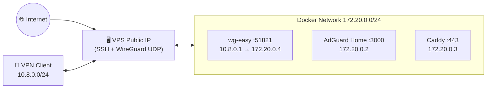

# Ansible Zero-Trust VPS


Ansible playbooks for a self-hosted zero-trust VPS stack: WireGuard VPN,
wg-easy web UI, AdGuard Home DNS, Caddy reverse proxy, UFW, and fail2ban.

## Table of Contents

- [Architecture](#architecture)
- [Stack Overview](#stack-overview)
- [Stack Licenses](#stack-licenses)
- [VPS Requirements](#vps-requirements)
- [What The Installer Changes](#what-the-installer-changes)
- [Deployment Modes](#deployment-modes)
- [Public Install Mode](#public-install-mode)
- [Remote Deployment Mode](#remote-deployment-mode)
- [Deployment Modes Comparison](#deployment-modes-comparison)
- [Configuration](#configuration)
- [Security Model](#security-model)
- [First Client Setup](#first-client-setup)
- [Troubleshooting](#troubleshooting)
- [Development Setup](#development-setup)

## Architecture



## Stack Overview

| Service | Image |
| --- | --- |
| wg-easy | `ghcr.io/wg-easy/wg-easy:15.3.0` |
| AdGuard Home | `adguard/adguardhome:v0.107.76` |
| Caddy | `caddy:2.11.3` |

## Stack Licenses

| Component | License |
|-----------|---------|
| This playbook | [MIT](LICENSE) |
| wg-easy | AGPL-3.0-only |
| AdGuard Home | GPL-3.0-only |
| Caddy | Apache-2.0 |

> **Note:** verify upstream license terms before modifying or redistributing
> the deployed stack. wg-easy is AGPL-3.0-only, which has network-service
> source-sharing obligations for modified versions.

## VPS Requirements

Use a fresh disposable Debian or Ubuntu VPS for the first run. The installer
and roles assume an apt-based Linux host with root privileges, a working SSH
session, and enough kernel support to run WireGuard and Docker.

Before running either deployment mode, verify:

- Root SSH access to the VPS on the current SSH port.
- Outbound internet access from the VPS to apt repositories, GitHub, PyPI, the
  Docker APT repository, and container registries.
- `/dev/net/tun` is available and WireGuard can be created by the kernel.
- The VPS kernel supports iptables/NAT for Docker and UFW.
- Provider-level firewall rules allow the current SSH port, the hardened SSH
  port you plan to use, and the WireGuard UDP port.

For public install mode, run the command from an interactive SSH session on the
VPS itself. Keep that original SSH session open until you have confirmed a new
login as `<admin_user>@<vps-ip>` on the hardened SSH port.

For remote deployment mode, prepare the Ansible controller first: install
Python/pip dependencies, install collections, configure inventory and group
vars, and encrypt vault files before running the playbook against the VPS.

## What The Installer Changes

Public install mode performs local setup on the VPS and then hands execution to
Ansible:

1. Checks root privileges, Debian/Ubuntu support, `apt-get`, and interactive
   `/dev/tty` access.
2. Prompts for SSH, WireGuard, admin, AdGuard, internal-domain, and SSH-key
   settings.
3. Installs minimal prerequisites, creates an Ansible virtualenv, checks out
   the selected repository ref, and installs Ansible collections.
4. Writes secrets to a temporary `0600` extra-vars file, runs `ansible-pull`,
   and removes that file after success or failure.
5. Prints SSH tunnel commands for first-client setup.

The Ansible playbook then changes the VPS in two phases:

1. Hardening: validates TUN/WireGuard support, installs base packages, creates
   the non-root admin user, installs the SSH key, configures sudo, applies
   sysctl hardening, opens SSH and WireGuard in UFW, enables default-deny
   firewall rules, hardens SSH, and configures fail2ban.
2. Orchestration: installs Docker, creates persistent service directories,
   writes AdGuard/Caddy/Compose configuration, starts wg-easy, AdGuard Home and
   Caddy, installs UFW-Docker integration, fetches the Caddy root CA, and
   verifies SSH and external HTTPS exposure.

## Deployment Modes

This project supports two deployment modes:

| Mode | Purpose |
|------|---------|
| [Public Install Mode](#public-install-mode) | Tagged one-command setup on a fresh VPS |
| [Remote Deployment Mode](#remote-deployment-mode) | Manage one or more VPS from your laptop |

Choose the mode that matches your use case.

## Public Install Mode

SSH onto your VPS and run:

```bash
curl -fsSL https://raw.githubusercontent.com/NikitaS2001/ansible-zero-trust-vps/v1.0.0/install.sh | sudo bash
```

The installer is interactive and asks for:

- **SSH port** (press Enter to use the role default)
- **WireGuard port** (press Enter to use the role default)
- **Admin username** (press Enter to use the role default)
- **Admin password** (for console access)
- **AdGuard admin password**
- **Internal domains** (press Enter to use the role defaults)
- **SSH public key** (paste your `id_ed25519.pub`)

Then it installs a local Ansible toolchain and runs `ansible-pull` against the
tagged public repository.

Use release tags for public installs. Do not install from `main` unless you are
testing unreleased changes on a disposable VPS.

To test an unreleased branch on a disposable VPS, use the same installer path
with explicit repository and ref overrides. Branch names are resolved against
`origin/` automatically.

```bash
TEST_REF=feat/public-installer-v1
curl -fsSL "https://raw.githubusercontent.com/NikitaS2001/ansible-zero-trust-vps/${TEST_REF}/install.sh" \
  | sudo env ZERO_TRUST_REPO_URL=https://github.com/NikitaS2001/ansible-zero-trust-vps.git \
      ZERO_TRUST_RELEASE_REF="${TEST_REF}" bash
```

## Remote Deployment Mode

Run this mode from your local Ansible controller after preparing a VPS that
meets the requirements above.

```sh
# 1. Copy and edit example files
cp inventory/hosts.yml.example inventory/hosts.yml
cp group_vars/all/vars.yml.example group_vars/all/vars.yml
cp group_vars/all/vault_services.yml.example group_vars/all/vault_services.yml
cp group_vars/all/vault_ssh.yml.example group_vars/all/vault_ssh.yml

# 2. Set values in inventory/hosts.yml and group_vars/all/vars.yml
# 3. Encrypt vault files
ansible-vault encrypt group_vars/all/vault_services.yml group_vars/all/vault_ssh.yml

# 4. Install controller dependencies and collections
python3 -m pip install --user ansible-core "passlib[bcrypt]"
ansible-galaxy collection install -r requirements.yml

# 5. Syntax-check and deploy
ansible-playbook --vault-password-file .vault_password --syntax-check site.yml
ansible-playbook --vault-password-file .vault_password site.yml -u root
```

## Deployment Modes Comparison

| Mode | Use Case | Command | Requires |
|------|----------|---------|----------|
| Public install | Fresh single VPS | `curl -fsSL .../v1.0.0/install.sh \| sudo bash` | SSH access to VPS |
| Remote | Manage multiple VPS from laptop | `ansible-playbook -i inventory/hosts.yml site.yml` | Ansible on local machine |

## Configuration

Key variables to set before first run:

| Variable | File | Purpose |
| --- | --- | --- |
| `ansible_host` | `inventory/hosts.yml` | Public VPS IP or DNS |
| `ssh_port` | `vars.yml` | Hardened SSH port |
| `wg_port` | `vars.yml` | Public WireGuard UDP port |
| `wg_vpn_subnet` | `vars.yml` | VPN client subnet, e.g. `10.8.0.0/24` |
| `wg_server_ip` | `vars.yml` | WireGuard server VPN IP, e.g. `10.8.0.1` |
| `docker_network_subnet` | `vars.yml` | Docker subnet, e.g. `172.20.0.0/24` |
| `adguard_container_ip` | `vars.yml` | AdGuard fixed Docker IP |
| `caddy_container_ip` | `vars.yml` | Caddy fixed Docker IP |
| `wg_easy_container_ip` | `vars.yml` | wg-easy fixed Docker IP |
| `admin_user` | `vars.yml` | Non-root SSH admin user |
| `wg_internal_domain` | `vars.yml` | wg-easy internal hostname |
| `adguard_internal_domain` | `vars.yml` | AdGuard internal hostname |
| `vault_adguard_password_hash` | `vault_services.yml` | AdGuard bcrypt hash |
| `vault_admin_ssh_pubkey` | `vault_ssh.yml` | SSH pubkey for `admin_user` |

After first run, update `inventory/hosts.yml` to use the hardened port:

```yaml
ansible_user: "<admin_user>"
ansible_port: <ssh_port>
```

## Security Model

- Vault files (`vault_services.yml`, `vault_ssh.yml`) hold secrets and must be
  encrypted with `ansible-vault` before running the playbook. Never commit
  unencrypted copies.
- Keep `.vault_password` out of git and readable only by your local user.
- wg-easy and AdGuard admin UIs are bound to `127.0.0.1` on the VPS. Access
  during initial setup is through SSH local forwarding only.
- Caddy is not published on the public interface. It serves `.internal`
  hostnames to VPN clients via the Docker network at `172.20.0.3`.
- Only SSH and WireGuard UDP are exposed publicly. No web service ports on
  the host.
- IPv6 is disabled for wg-easy containers to avoid startup issues on
  providers without working IPv6.
- Do not add the WireGuard client subnet to `fail2ban_ignore_ips`; doing so
  lets compromised VPN clients bypass SSH brute-force protection.

## First Client Setup

After the playbook finishes, open an SSH tunnel for the wg-easy setup wizard:

```sh
ssh -p <ssh_port> -L 51821:127.0.0.1:51821 <admin_user>@<ansible_host>
```

1. Open `http://127.0.0.1:51821` in a browser on your local machine.
2. Complete the wg-easy setup wizard:

   | Field | Value |
   | --- | --- |
   | Host | Your `ansible_host` |
   | Port | Your `wg_port` |
   | DNS | Your `wg_client_dns` (AdGuard IP `172.20.0.2`) |

3. In wg-easy client Allowed IPs, include both subnets so all traffic and
   the Docker network route through the VPN:

   ```
   10.8.0.0/24, 172.20.0.0/24
   ```

4. Create a client config in wg-easy and connect to WireGuard.
5. AdGuard rewrites `*.internal` to Caddy's Docker IP. Access services over
   the VPN at:

   ```
   https://wg.internal
   https://adguard.internal
   ```

6. Import `fetched_certs/<inventory-host>/root.crt` into your client OS or
   browser to trust the `.internal` HTTPS endpoints.

AdGuard is also reachable during initial setup at `http://127.0.0.1:3000` via:

```sh
ssh -p <ssh_port> -L 3000:127.0.0.1:3000 <admin_user>@<ansible_host>
```

## Troubleshooting

### Public install mode

**"Interactive installation requires a TTY"**

The public installer reads prompts from `/dev/tty` so it works with
`curl | sudo bash`. SSH into the VPS with an interactive terminal and run the
command again.

**"Unsupported OS"**

The public installer supports Debian/Ubuntu systems with `apt-get`. Use remote
Ansible mode for other targets after adapting the roles.

## Development Setup

For local contributor checks, install the pre-commit hooks:

```bash
pip install pre-commit
pre-commit install
pre-commit run --all-files
```
