# Ansible Zero-Trust VPS


Ansible playbooks for a self-hosted zero-trust VPS stack: WireGuard VPN,
wg-easy web UI, AdGuard Home DNS, Caddy reverse proxy, UFW, and fail2ban.

## Table of Contents

- [Architecture](#architecture)
- [Stack Overview](#stack-overview)
- [Quick Start](#quick-start)
- [Configuration](#configuration)
- [Security Model](#security-model)
- [First Client Bootstrap](#first-client-bootstrap)

## Architecture

```mermaid
flowchart LR
    Internet(("&#127760; Internet"))
    Client["&#128268; VPN Client\n10.8.0.0/24"]
    VPS["&#128421; VPS Public IP\n&#40;SSH + WireGuard UDP&#41;"]
    subgraph Docker_Network["Docker Network 172.20.0.0/24"]
        WG["wg-easy :51821\n10.8.0.1 → 172.20.0.4"]
        AD["AdGuard Home :3000\n172.20.0.2"]
        CAD["Caddy :443\n172.20.0.3"]
    end

    Internet --> VPS
    Client <--> VPS
    VPS <--> Docker_Network
```



## Stack Overview

| Service | Image |
| --- | --- |
| wg-easy | `ghcr.io/wg-easy/wg-easy:15` |
| AdGuard Home | `adguard/adguardhome:v0.107.76` |
| Caddy | `caddy:2.11.3` |

## Quick Start

```sh
# 1. Copy and edit example files
cp inventory/hosts.yml.example inventory/hosts.yml
cp group_vars/all/vars.yml.example group_vars/all/vars.yml
cp group_vars/all/vault_services.yml.example group_vars/all/vault_services.yml
cp group_vars/all/vault_ssh.yml.example group_vars/all/vault_ssh.yml

# 2. Set values in inventory/hosts.yml and group_vars/all/vars.yml
# 3. Encrypt vault files
ansible-vault encrypt group_vars/all/vault_services.yml group_vars/all/vault_ssh.yml

# 4. Install collections
ansible-galaxy collection install -r requirements.yml

# 5. Syntax-check and deploy
ansible-playbook --vault-password-file .vault_password --syntax-check site.yml
ansible-playbook --vault-password-file .vault_password site.yml -u root
```

## Configuration

Key variables to set before first run:

| Variable | File | Purpose |
| --- | --- | --- |
| `ansible_host` | `inventory/hosts.yml` | Public VPS IP or DNS |
| `ssh_port` | `vars.yml` | Hardened SSH port |
| `wg_port` | `vars.yml` | Public WireGuard UDP port |
| `wg_vpn_subnet` | `vars.yml` | VPN client subnet, e.g. `10.8.0.0/24` |
| `wg_server_ip` | `vars.yml` | WireGuard server VPN IP, e.g. `10.8.0.1` |
| `docker_network_subnet` | `vars.yml` | Docker subnet, e.g. `172.20.0.0/24` |
| `adguard_container_ip` | `vars.yml` | AdGuard fixed Docker IP |
| `caddy_container_ip` | `vars.yml` | Caddy fixed Docker IP |
| `wg_easy_container_ip` | `vars.yml` | wg-easy fixed Docker IP |
| `admin_user` | `vars.yml` | Non-root SSH admin user |
| `wg_internal_domain` | `vars.yml` | wg-easy internal hostname |
| `adguard_internal_domain` | `vars.yml` | AdGuard internal hostname |
| `vault_adguard_password_hash` | `vault_services.yml` | AdGuard bcrypt hash |
| `vault_admin_ssh_pubkey` | `vault_ssh.yml` | SSH pubkey for `admin_user` |

After first run, update `inventory/hosts.yml` to use the hardened port:

```yaml
ansible_user: "<admin_user>"
ansible_port: <ssh_port>
```

## Security Model

- Vault files (`vault_services.yml`, `vault_ssh.yml`) hold secrets and must be
  encrypted with `ansible-vault` before running the playbook. Never commit
  unencrypted copies.
- Keep `.vault_password` out of git and readable only by your local user.
- wg-easy and AdGuard admin UIs are bound to `127.0.0.1` on the VPS. Access
  during bootstrap is through SSH local forwarding only.
- Caddy is not published on the public interface. It serves `.internal`
  hostnames to VPN clients via the Docker network at `172.20.0.3`.
- Only SSH and WireGuard UDP are exposed publicly. No web service ports on
  the host.
- IPv6 is disabled for wg-easy containers to avoid startup issues on
  providers without working IPv6.
- Do not add the WireGuard client subnet to `fail2ban_ignore_ips`; doing so
  lets compromised VPN clients bypass SSH brute-force protection.

## First Client Bootstrap

After the playbook finishes, open an SSH tunnel for the wg-easy setup wizard:

```sh
ssh -p <ssh_port> -L 51821:127.0.0.1:51821 <admin_user>@<ansible_host>
```

1. Open `http://127.0.0.1:51821` in a browser on your local machine.
2. Complete the wg-easy setup wizard:

   | Field | Value |
   | --- | --- |
   | Host | Your `ansible_host` |
   | Port | Your `wg_port` |
   | DNS | Your `wg_client_dns` (AdGuard IP `172.20.0.2`) |

3. In wg-easy client Allowed IPs, include both subnets so all traffic and
   the Docker network route through the VPN:

   ```
   10.8.0.0/24, 172.20.0.0/24
   ```

4. Create a client config in wg-easy and connect to WireGuard.
5. AdGuard rewrites `*.internal` to Caddy's Docker IP. Access services over
   the VPN at:

   ```
   https://wg.internal
   https://adguard.internal
   ```

6. Import `fetched_certs/<inventory-host>/root.crt` into your client OS or
   browser to trust the `.internal` HTTPS endpoints.

AdGuard is also reachable during bootstrap at `http://127.0.0.1:3000` via:

```sh
ssh -p <ssh_port> -L 3000:127.0.0.1:3000 <admin_user>@<ansible_host>
```
